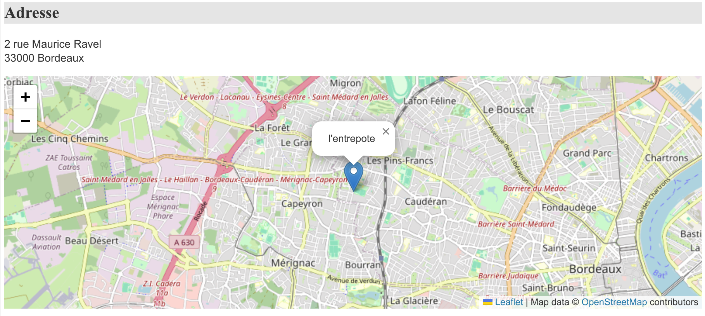
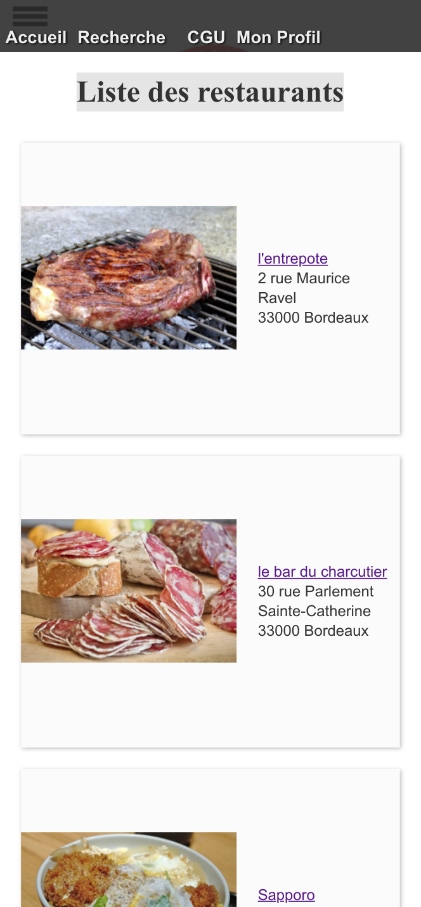
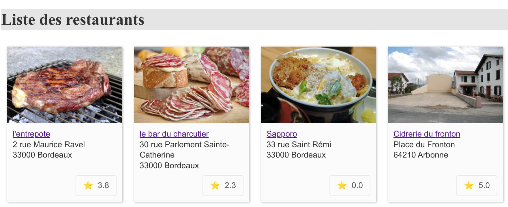
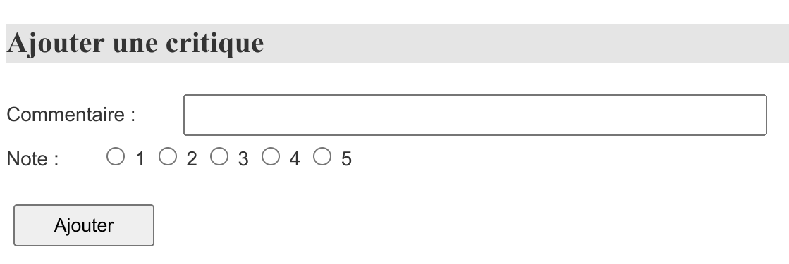
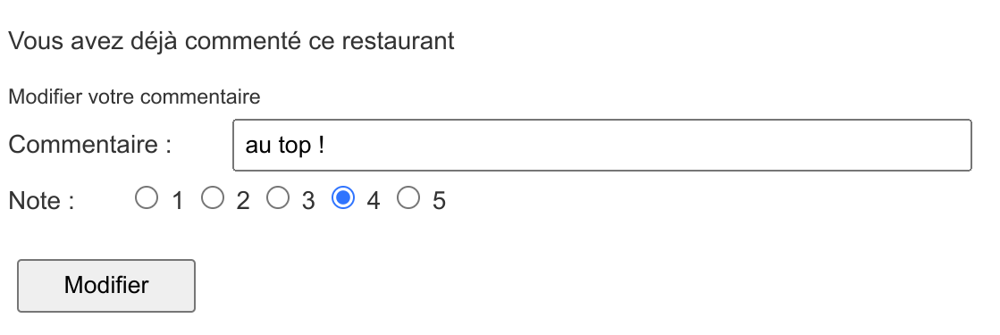
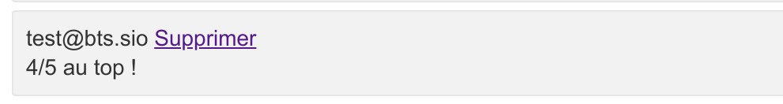

## Documentation Technique du Projet SIO R3ST0

## Table des matières

1. [Introduction](#introduction)
2. [Ajout de la carte](#ajout-de-la-carte)
3. [Adaptation du responsive](#adaptation-du-responsive)
4. [Système d'étoiles](#système-d'étoiles)
5. [Fonctionnalité de Commentaire et Modification de la Fonctionnalité de Critique](#fonctionnalité-de-commentaire-et-modification-de-la-fonctionnalité-de-critique)

## Introduction

Ce document fournit une vue d'ensemble technique du projet SIO R3ST0. Il couvre spécifiquement les fonctionnalités d'ajout de la carte, d'adaptation du responsive et du système d'étoiles.

## Ajout de la carte



La fonctionnalité d'ajout de la carte permet d'afficher une carte interactive sur la page de détail du restaurant en utilisant la bibliothèque Leaflet.js. Voici une explication détaillée du code :

### 1. Récupération de l'adresse du restaurant
Nous commençons par récupérer l'adresse du restaurant depuis le serveur et la stockons dans la variable `address`. Cette étape est essentielle pour obtenir l'emplacement exact du restaurant.

```php
var address = <?= json_encode($unResto['numAdrR'] . ' ' . $unResto['voieAdrR'] . ', ' . $unResto['cpR'] . ' ' . $unResto['villeR']); ?>;
```

### 2. Initialisation de la carte
Nous créons ensuite une instance de la carte Leaflet dans la `<div>` avec l'ID "map". La carte est configurée avec un marqueur pour le restaurant en utilisant les coordonnées géographiques obtenues à partir de l'API de données d'adresse du gouvernement français.

```javascript
var map = L.map('map');
var loading = document.getElementById('loading');
console.log("fetching address: " + address);

loading.style.display = 'block';
```

### 3. Récupération des coordonnées géographiques
Nous utilisons l'API de données d'adresse du gouvernement français pour obtenir les coordonnées géographiques à partir de l'adresse du restaurant. Les résultats sont affichés dans la console pour le débogage.

```javascript
fetch('https://api-adresse.data.gouv.fr/search/?q=' + encodeURIComponent(address))
    .then(response => response.json())
    .then(data => {
        var latitude = data.features[0].geometry.coordinates[1];
        var longitude = data.features[0].geometry.coordinates[0];
        console.log("latitude: " + latitude);
        console.log("longitude: " + longitude);
```

### 4. Affichage de la carte
Une fois les coordonnées obtenues, la carte est centrée sur ces coordonnées, et un marqueur avec le nom du restaurant est ajouté à la carte.

```javascript
map.setView([latitude, longitude], 13);

L.tileLayer('https://{s}.tile.openstreetmap.org/{z}/{x}/{y}.png', {
    attribution: 'Map data &copy; <a href="https://www.openstreetmap.org/">OpenStreetMap</a> contributors',
    maxZoom: 18,
}).addTo(map);

L.marker([latitude, longitude]).addTo(map)
    .bindPopup(<?= json_encode($unResto['nomR']); ?>)
    .openPopup();

loading.style.display = 'none';
```

[Voir le code Complet](https://github.com/andronedev/sio_r3st0/blob/f103856713e5f9400fc19c1aab0e65750c7ec669/vue/vueDetailResto.php#L52)


## Adaptation du responsive



L'adaptation du responsive a été réalisée pour rendre le site utilisable sur les appareils mobiles. Voici quelques ajustements qui ont été apportés pour améliorer la compatibilité avec les petits écrans :

```html
<!-- Meta tag pour la gestion du viewport -->
<meta name="viewport" content="width=device-width, initial-scale=1.0">
```

Le méta-tag ci-dessus a été ajouté pour garantir que la mise en page s'adapte correctement à la largeur de l'écran du dispositif utilisé.

```css
/* Media query pour les écrans de petite taille (600px ou moins) */
@media only screen and (max-width: 600px) {
    /* Réglages spécifiques pour le responsive */

    /* Exemple de style pour la classe .card */
    .card {
        width: 85% !important;
        display: flex;
        align-items: center;
    }

    /* Exemple de style pour la classe .photoCard */
    .photoCard {
        flex: 0 0 auto;
        margin-right: 10px;
    }

    /* Ajoutez ici d'autres styles pour d'autres éléments si nécessaire */
}
```

**Ces styles seront appliqués uniquement lorsque l'écran a une largeur maximale de 600 pixels (ou moins).** Il est possible de modifier cette partie du code si vous souhaitez apporter des ajustements spécifiques à la mise en page sur les appareils mobiles.

## Système d'étoiles



Le système d'étoiles a été ajouté sur la page de la liste des restaurants. Pour ce faire, le contrôleur et la vue de la liste des restaurants ont été modifiés. Cela permet aux utilisateurs de voir rapidement la note globale de chaque restaurant.

### Modifications apportées

Les améliorations du système d'étoiles ont été réalisées grâce à plusieurs modifications du code, notamment dans le contrôleur des listes de restaurants, les fichiers de style CSS, et la vue de la liste des restaurants. Voici un résumé des changements effectués :

#### Contrôleur (`controleur/listeRestos.php`)

- **Inclusion d'un nouveau modèle** : Le fichier `bd.critiquer.inc.php` a été inclus pour accéder aux fonctions permettant de calculer la note moyenne des restaurants.
  
- **Calcul des notes moyennes** : Pour chaque restaurant listé, la note moyenne est calculée en faisant appel à la fonction `getNoteMoyenneByIdR` et est ajoutée au tableau des restaurants sous la clé `noteMoy`.

#### CSS (`css/base.css`)

- **Style du système d'étoiles** : Des styles spécifiques ont été ajoutés pour le nouvel élément `.note`, permettant d'afficher la note moyenne de manière élégante et lisible. Ces styles incluent la mise en forme du texte, l'ajout d'une icône d'étoile et le changement de l'apparence au survol.

#### Vue de la liste des restaurants (`vue/vueListeRestos.php`)

- **Affichage de la note moyenne** : Au sein de chaque carte de restaurant, un nouvel élément HTML a été ajouté pour afficher la note moyenne à l'aide d'une icône d'étoile suivie de la valeur numérique de la note. Cette présentation visuelle permet aux utilisateurs de rapidement évaluer la qualité du restaurant.

## Fonctionnalité de Commentaire et Modification de la Fonctionnalité de Critique

### Ajout de la Fonctionnalité de Commentaire

La fonctionnalité de commentaire a été implémentée pour permettre aux utilisateurs de laisser des commentaires et des notes sur les restaurants. Cette section décrit les modifications apportées au système pour intégrer cette nouvelle fonctionnalité.

#### Contrôleur (`controleur/commenter.php`)

Un nouveau contrôleur `commenter.php` a été ajouté pour gérer les requêtes POST liées aux commentaires des utilisateurs. Ce fichier s'occupe de la logique d'ajout et de modification des critiques par les utilisateurs.

```php
// Extrait de commenter.php
if ($_SERVER["REQUEST_METHOD"] == "POST") {
    $commentaire = $_POST["commentaire"];
    $idR = $_POST["idR"];
    $note = intval($_POST["note"]);
    $do = $_POST["do"];

    if ($do == "ajouter") {
        addCritiquer($idR, getMailULoggedOn(), $note, $commentaire);
        header("Location: ?action=detail&idR=$idR");
        exit;
    } else if ($do == "modifier") {
        editCritiquer($idR, getMailULoggedOn(), $note, $commentaire);
        header("Location: ?action=detail&idR=$idR");
        exit;
    }
}
```

Ce code gère deux actions : `"ajouter"` pour les nouvelles critiques et `"modifier"` pour les critiques existantes. La fonction `addCritiquer` ajoute une nouvelle critique, tandis que `editCritiquer` met à jour une critique existante.

### Vue (`vue/vueDetailResto.php`)

La vue détail d'un restaurant a été mise à jour pour inclure un formulaire permettant d'ajouter ou de modifier une critique.

```html
<!-- Extrait de vueDetailResto.php pour l'ajout d'une critique -->
<form action="?action=commenter" method="POST">
    <label for="commentaire">Commentaire :</label>
    <input type="text" name="commentaire" id="commentaire" required>
    <div> 
        <label>Note :</label>
        <input type="radio" name="note" value="1" required> 1
        <!-- autres boutons radio -->
    </div>
    <input type="hidden" name="do" value="ajouter">
    <input type="hidden" name="idR" value="<?= $unResto['idR']; ?>">
    <input type="submit" value="Ajouter">
</form>
```

Ce formulaire apparaît si l'utilisateur n'a pas encore commenté le restaurant. Il comprend un champ pour le commentaire, des boutons radio pour la note, et des champs cachés pour déterminer l'action et l'identifiant du restaurant.

#### Affichage Conditionnel du Formulaire
Sur la page de détail d'un restaurant, la logique suivante détermine quel formulaire afficher à l'utilisateur :
    
```php
    // Extrait adapté de vueDetailResto.php
<?php if ($maCritique == false) { ?>
    <!-- Formulaire pour ajouter une nouvelle critique -->
    <form action="?action=commenter" method="POST">
        <!-- Champs du formulaire pour l'ajout -->
    </form>
<?php } else { ?>
    <!-- Formulaire pour modifier une critique existante -->
    <form action="?action=commenter" method="POST">
        <!-- Champs pré-remplis avec les données de la critique existante -->
    </form>
<?php } ?>

```
Si `maCritique` retourne false, cela signifie que l'utilisateur n'a pas encore critiqué le restaurant, et donc le formulaire d'ajout de critique est affiché. Si `maCritique` retourne un tableau avec les détails de la critique existante, le formulaire de modification est affiché avec les champs pré-remplis par les données existantes (commentaire et note).

#### Gestion de l'Ajout et de la Modification

La distinction entre l'ajout et la modification est gérée par un champ caché nommé `do` dans le formulaire, qui peut prendre les valeurs `"ajouter"` ou `"modifier"`. Ce champ détermine l'action à effectuer lorsque le formulaire est soumis :

- Pour une nouvelle critique, `do` est défini à `"ajouter"`, et la fonction `addCritiquer` est appelée.
- Pour modifier une critique existante, `do` est défini à `"modifier"`, et la fonction `editCritiquer` est appelée.

Cette approche permet une gestion efficace et intuitive des critiques par les utilisateurs, facilitant à la fois la contribution de nouveaux avis et la mise à jour d'avis existants.

### Suppression des Commentaires


#### Implémentation de la Fonctionnalité de Suppression

La possibilité pour un utilisateur de supprimer son propre commentaire a été intégrée au système. Cette fonctionnalité est essentielle pour permettre aux utilisateurs de gérer leur propre contenu, en particulier s'ils souhaitent retirer un avis précédemment publié.

#### Contrôleur (`controleur/supprimerCritique.php`)

Un nouveau contrôleur `supprimerCritique.php` a été ajouté pour gérer la suppression des critiques. Ce fichier contrôleur traite les demandes de suppression initiées par les utilisateurs.

```php
// Extrait simplifié de supprimerCritique.php
include_once "$racine/modele/bd.critiquer.inc.php";

$idR = $_GET["idR"];
$mailU = getMailULoggedOn();

deleteCritiquer($idR, $mailU);
header("Location: ?action=detail&idR=$idR");
```
Cette fonction récupère l'identifiant du restaurant (`idR`) et l'adresse e-mail de l'utilisateur connecté (`mailU`), appelle la fonction `deleteCritiquer` pour supprimer la critique, puis redirige l'utilisateur vers la page de détail du restaurant.

#### Modification du modèle (`modele/bd.critiquer.inc.php`)
La fonction `deleteCritiquer` a été ajoutée au modèle pour gérer la suppression des critiques. Cette fonction prend l'identifiant du restaurant et l'adresse e-mail de l'utilisateur connecté comme paramètres, puis supprime la critique correspondante de la base de données.

```php
function deleteCritiquer($idR, $mailU) {
    try {
        $cnx = connexionPDO();
        $req = $cnx->prepare("delete from critiquer where idR=:idR and mailU=:mailU");
        $req->bindValue(':idR', $idR, PDO::PARAM_INT);
        $req->bindValue(':mailU', $mailU, PDO::PARAM_STR);
        
        $req->execute();
    } catch (PDOException $e) {
        print "Erreur !: " . $e->getMessage();
        die();
    }
}

```
Cette fonction utilise une requête SQL pour supprimer la critique correspondante de la base de données. Elle est conçue pour être appelée par le contrôleur `supprimerCritique.php` lorsqu'un utilisateur souhaite supprimer son propre commentaire.

#### Modification de la Vue (`vue/vueDetailResto.php`)

La vue de détail du restaurant a été mise à jour pour inclure un lien ou un bouton permettant à l'utilisateur de supprimer son commentaire.


### Résumé

La fonctionnalité de commentaire enrichit l'interaction des utilisateurs avec le site, offrant la possibilité de partager des avis détaillés sur les restaurants. L'ajout de cette fonctionnalité implique des modifications au niveau des contrôleurs pour gérer les actions des utilisateurs, ainsi que des mises à jour dans les vues pour afficher les formulaires de commentaire.