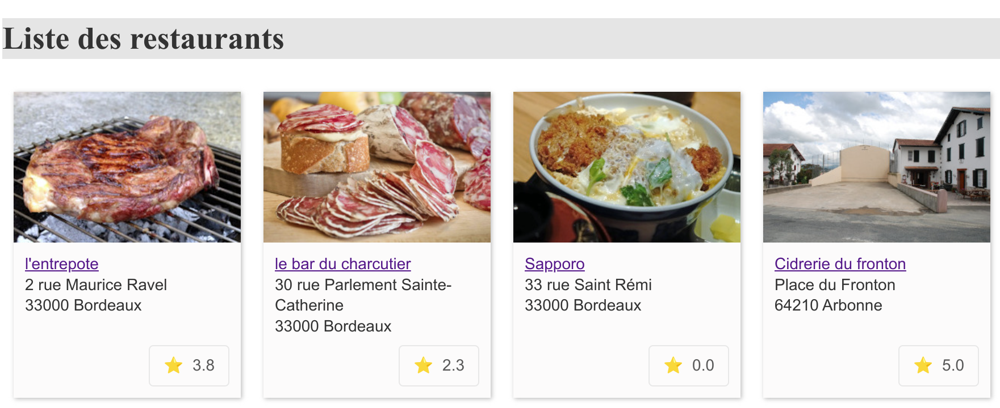
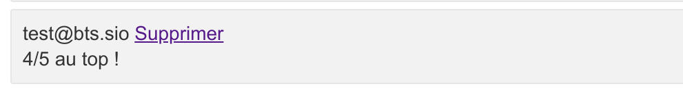

# Documentation Utilisateur du Projet SIO R3ST0

## Table des Matières

1. [Introduction](#1-introduction)
2. [Navigation sur la Carte des Restaurants](#2-navigation-sur-la-carte-des-restaurants)
3. [Utilisation sur Mobile](#3-utilisation-sur-mobile)
4. [Comprendre les Évaluations des Restaurants](#4-comprendre-les-évaluations-des-restaurants)
5. [Ajouter et Modifier des Commentaires sur les Restaurants](#5-ajouter-et-modifier-des-commentaires-sur-les-restaurants)

## 1. Introduction

Bienvenue dans le guide utilisateur de SIO R3ST0, votre plateforme de référence pour explorer, découvrir et choisir les meilleurs restaurants à proximité.

## 2. Navigation sur la Carte des Restaurants

### Accéder à la Carte

- **Ouvrir le Détail d'un Restaurant** : Sur la page de chaque restaurant, vous trouverez une carte interactive en bas de la page. Cette carte vous permet de voir l'emplacement exact du restaurant.

### Utiliser la Carte

- **Interagir avec la Carte** : Vous pouvez zoomer, vous déplacer et cliquer sur le marqueur pour obtenir le nom du restaurant. La carte est intuitive et facile à utiliser, vous permettant de visualiser rapidement où se trouve le restaurant que vous consultez.

## 3. Utilisation sur Mobile

Notre site est optimisé pour les mobiles, garantissant une expérience utilisateur fluide et accessible, peu importe où vous vous trouvez.

### Conseils pour une Meilleure Expérience Mobile

- **Naviguer sur le Site** : Le site s'adapte automatiquement à la taille de votre écran, rendant la lecture et la navigation confortables.

## 4. Comprendre les Évaluations des Restaurants

### Système d'Étoiles

- **Vue d'Ensemble** : Sur la page listant les restaurants, vous remarquerez des étoiles à côté de chaque nom. Ces étoiles représentent la note moyenne donnée par les utilisateurs, vous offrant un aperçu rapide de la qualité du restaurant.

### Comment Lire les Étoiles

- **Signification des Étoiles** : Chaque étoile correspond à la note moyenne totale sur 5 donnée par les clients précédents. Plus il y a d'étoiles, meilleure est la réputation du restaurant.

## 5. Ajouter et Modifier des Commentaires sur les Restaurants

La plateforme SIO R3ST0 vous offre la possibilité de partager votre expérience dans les restaurants en ajoutant des commentaires et des notes. Vous pouvez également modifier vos commentaires existants pour refléter vos expériences les plus récentes.

### Ajouter un Commentaire

Pour laisser un commentaire sur un restaurant :

1. **Accédez au Détail du Restaurant** : Recherchez le restaurant que vous souhaitez commenter et ouvrez sa page de détail.
2. **Formulaire de Commentaire** : Faites défiler la page jusqu'à la section des commentaires. Si vous n'avez pas encore laissé de commentaire pour ce restaurant, vous verrez un formulaire vierge intitulé "Ajouter une critique".
3. **Remplissez le Formulaire** : Entrez votre commentaire dans le champ prévu et sélectionnez une note entre 1 et 5 étoiles.
4. **Soumettez votre Commentaire** : Cliquez sur le bouton "Ajouter" pour publier votre commentaire.

### Modifier un Commentaire Existant

Si vous avez déjà commenté un restaurant et souhaitez modifier votre avis :

1. **Ouvrez la Page du Restaurant** : Trouvez le restaurant concerné et accédez à sa page de détail.
2. **Section des Commentaires** : La page détectera automatiquement si vous avez déjà laissé un commentaire. Au lieu du formulaire d'ajout, vous verrez votre commentaire actuel avec une option "Modifier votre commentaire".
3. **Modifiez votre Commentaire** : Changez le texte de votre commentaire ou ajustez la note selon votre nouvelle expérience.
4. **Mettez à Jour le Commentaire** : Après avoir apporté les modifications souhaitées, cliquez sur le bouton "Modifier" pour mettre à jour votre commentaire.

### Conseils pour un Bon Commentaire

- **Soyez Clair et Constructif** : Expliquez ce que vous avez aimé ou ce qui pourrait être amélioré. Votre retour aidera d'autres clients à faire leur choix et encouragera les restaurants à améliorer leur service.
- **Restez Respectueux** : Même si votre expérience n'a pas été à la hauteur de vos attentes, exprimez votre opinion de manière respectueuse.

### Suppression de Votre Commentaire

Vous avez la possibilité de supprimer un commentaire que vous avez précédemment laissé sur un restaurant, si vous le souhaitez.

### Comment Supprimer un Commentaire

1. **Accédez au Détail du Restaurant** : Trouvez le restaurant sur lequel vous avez laissé un commentaire et ouvrez sa page de détail.
2. **Trouvez Votre Commentaire** : Naviguez jusqu'à la section des commentaires où votre avis est publié.
3. **Option de Suppression** : À côté de votre commentaire, vous verrez une option "Supprimer" ou une icône de corbeille.
