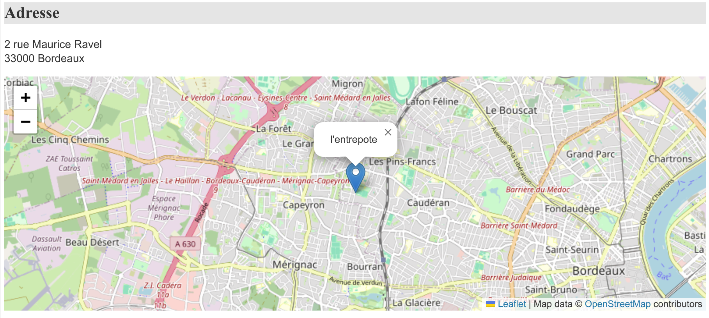

# r3st0.fr

Un projet scolaire en BTS SIO.

## Table des matières

- [Installation](#installation)
- [Utilisation](#utilisation)
- [Améliorations](#améliorations)

## Installation

1. Cloner le projet
```bash 
git clone ...
```

2. Modifier le fichier [modele/bd.inc.php](modele/bd.inc.php) avec vos informations de connexion à la base de données

3. Importer le fichier [base.sql](base.sql) dans votre base de données

4. Ouvrir le projet avec un serveur PHP
```bash
php -S localhost:8080
```

## Utilisation

Ouvrir le projet avec un serveur PHP
```bash
php -S localhost:8080
```

## Améliorations

- [x] Ajout de la carte qui montre le lieu du restaurant sur la page detail

[Voir le code](https://github.com/andronedev/sio_r3st0/blob/f103856713e5f9400fc19c1aab0e65750c7ec669/vue/vueDetailResto.php#L52) | 
La fonctionnalité utilise Leaflet.js pour afficher une carte interactive dans une div avec l'id map. L'adresse du restaurant est récupérée depuis le serveur et encodée en JSON. Les coordonnées géographiques sont obtenues à partir de l'API de données d'adresse du gouvernement français. La carte est centrée sur ces coordonnées avec un marqueur affichant le nom du restaurant. Les erreurs sont enregistrées dans la console.

- [ ] Résponsivité
C'est une adaptation du site pour les appareils mobiles. Même si j'ai fait que le site soit utilisable sur les appareils mobiles, il y a encore des améliorations à faire pour que ce soit plus agréable à utiliser **mais ce n'est pas le but du projet**.

